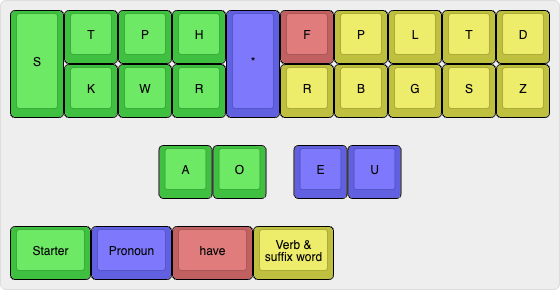
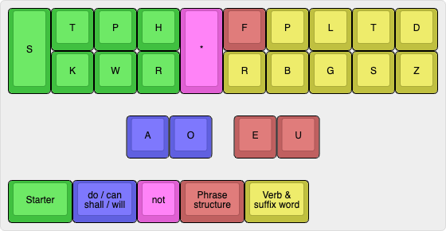

# Jeff's phrasing dictionary for Plover

# Background

In many systems, there are strokes possible where the phrases formed are
typically unusable. For example, the verb endings or tense could mismatch, such
as: `I really doesn't wanted`.

This phrasing dictionary automatically matches tenses and verb forms,
which makes it easier to learn because there's less to remember. With the
key-space freed up, extra flexibility has been added to enable more versatility
with the phrases.

Some examples:

- `SWR-GT` produces `I go to`
- `KWHR-GT` produces `he goes to`
- `KWHRUGT` produces `does he go to`
- `SWR-GTD` produces `I went to`
- `KWHR-GTD` produces `he went to`
- `SWHEUGTD` produces `when I went to`
- `SWRAFGTD` produces `I could have gone to`
- `KWHRO*UFGTD` produces `he just shouldn't go to`
- `KWHRO*EGTD` produces `he shouldn't be going to`
- `SWRAOEUFGTD` produces `I would never go to`
- `SWREFGT` produces `I have been going to`
- `STWHAOEUGT` produces `that will still go to`
- `SWR-RPBT` produces `I understand the`
- `STHRAOBT` produces `there will be a`
- `SWRA*EURPBT` produces `I still can't understand the`
- `SWR*UFPGTSDZ/TWRAOEPBLGTD` produces `I just didn't expect that we would be finding that`
- `WHA/KPWRUPBG/TWROERPD` produces `what do you think we should be doing`
- `KWR/KPWRURPTD` produces `why did you do it`
- `SWR*PB/SWHR*EGTD` produces `I don't know where she went to`

Many decisions on the word choices were taken from statistical data and
Google Books N-gram Viewer.

This dictionary also supports full reverse lookup, so you can see how to
stroke phrases in Plover's suggestions window.

# System

There are two ways phrases can be constructed -- simple form and full form.

## Simple form

A simple phrase is constructed with:

1. A starter (`what`, `that`, `if`, `when`, `where`, `who`)
2. A pronoun (`I`, `he`, `she`, `you`, `we`, `they`)
3. Optional `have`
4. A verb e.g. `go`, `say`, `understand`, etc.
5. An optional suffix word. These are specific to each verb.
6. A tense

Example: For the stroke `SWHUFBGT`

1. `SWH` is the starter: `when`
2. `U` is `you`
3. `F` is `have`
4. `BG` is the verb `come`
5. `T` is the suffix word `to`
6. Phrase is not using past tense as there is no `-D`

This forms the expected phrase: `when you have come to`

## Full form

The phrase is constructed with:

1. A starter (`I`, `you`, `he`, `she`, `it`, `we`, `they`, `that`, `this`, `there`)
2. A choice of auxiliary verb `do`/`can`/`shall`/`will`
3. An optional `not`
4. Phrase structure, controlling word order and `just`/`still`/`never`/`even`/`have`/`be`/`always`
5. A verb e.g. `go`, `say`, `understand`, etc.
6. An optional suffix word. These are specific to each verb.
7. A tense

The phrase will generally be constructed in a manner that feels grammatically
correct.

Example 1: For the stroke `SWRO*FGTD`:

1. `SWR` is the starter: `I`
2. `O` is `shall`
3. `*` is `not`
4. `F` is `have`
5. `G` is the verb `go`
6. `T` is `to`
7. `D` is for past tense

Once the verb forms and tenses are matched and short form applied, this results
in: `I shouldn't have gone to`

Example 2: See how the verb 'be' changes:

- `SWR-B` produces `I am`
- `SWR-BD` produces `I was`
- `SWR-FB` produces `I have been`
- `SWR-FBD` produces `I had been`
- `SWROB` produces `I shall be`
- `SWROBD` produces `I should be`

# Simple form

## Starters

Simple form starters use the keys on the left hand side of the board, including
the left side vowels:

- `STHA`: `that`
- `STPA`: `if`
- `SWH`: `when`
- `SWHA`: `what`
- `SWHR`: `where`
- `SWHO`: `who`
- `SPWH`: `but`
- `SKP`: `and` [*]

[*] Using SKP for `and` causes some conflicts with the default dictionary.
This phrasing module does _NOT_ try and replace the following:

- `SKPUR`: "and you're" (would be "and you run")
- `SKPUL`: "and you'll" (would be "and you look")
- `SKPEUT`: "and it" (would be "and I have", but this can be stroked with `SKPEUF`)
- `SKP*`: Fingerspelling "&".

If there are other conflicts, you can modify the file and add specific
exceptions to the `NON_PHRASE_STROKES` section, or remove the `SKP` entry from
`SIMPLE_STARTERS` altogether.

## Pronouns

Pronouns use the following:

- `EU`: `I`
- `*EU`: `we`
- `E`: `he`
- `*E`: `she`
- `U`: `you`
- `*U`: `they`
- `*`: `it`

## Have

Simple form uses `-F` to add the word `have` and causes the verb to change to
its past participle form.

- `SWHAURP`: `what you do`
- `SWHAUFRP`: `what you have done`
- `STPAEUGD`: `if I went`
- `STPAOUFGD`: `if I had gone`

## Verb & suffix words

The verb and suffix words follow the same schema as the full form detailed below.

# Full form parts

## Starters

Full form starters use the keys on the left hand side of the board:

- `SWR`: `I`
- `KPWR`: `you`
- `KWHR`: `he`
- `SKWHR`: `she`
- `KPWH`: `it`
- `TWR` : `we`
- `TWH`: `they`
- `STKH`: `this`
- `STWH`: `that`
- `STHR`: `there` (third person singular form -- \*)
- `STPHR`: `there` (third person plural form -- \*)
- `STKPWHR`: `` (empty -- third person singular form)
- `STWR`: `` (empty -- third person plural form)

(\*) Note that `there` can only use a limited set of verbs to avoid collisions
with the main dictionary.

Examples:

- `SWR-RPGT/STWR-RPBT` produces 'I need to understand the'
- `STHR-BG` produces `there comes`
- `STPHR-BG` produces `there come`
- `STHRAOEFD` produces `there would have been`
- `STHRAOEURPGT` produces `there will still need to`
- `KWHR-PL/STWR-FPBT` produces 'he may have known that'
- `SKWRAEUPB/STKPWHREUFGT` produces 'Jane never goes to'

## Do, Can, Shall, Will

The keys `AO*` are used to determine which of the additional words are added.
The form that is added depends on the tense of the verb. `*` is added to
get the negative version.

| `A O` | Word            | Negative forms           |
| ----- | --------------- | ------------------------ |
| `_ _` | do / does / did | don't / doesn't / didn't |
| `A _` | can / could     | can't / couldn't         |
| `_ O` | shall / should  | shall not / shouldn't    |
| `A O` | will / would    | won't / wouldn't         |

To get `did`, `should`, `could`, `would`, use a past tense verb (or past tense
placeholder `-D`).

There are special cases in the phrase structure section so that `do` can be
omitted.

## Phrase structure

`EUF` controls word ordering and how the words `just`, `still`, `never`,
`even`, `be` and `have` and `always` combine into the sentence.

- `E` is used for verb forms of `to be`.

- `F` is used for verb forms of `to have`.

- `EF` is used for verb forms of `have been`.

- `U` is used to swap the order of starter and middle words:

  - `SWROGTD`: `I should go to`
  - `SWROUGTD`: `should I go to`

- `EU` gives the word `still` and is used as a suffix in positive form,
  but as a prefix for negative form

  - `...AEU...`: `... can still ...`
  - `...A*EU...`: `... still can't ...`

- `UF` gives the word `just` and is used as a suffix in positive form,
  but as a prefix for negative form

  - `...AUF...`: `... can just ...`
  - `...A*UF...`: `... just can't ...`

- `-EUF` appends the word `never` for positive forms, and `even` for negative
  forms.

  - `...AEUF...`: `... can never ...`
  - `...A*EUF...`: `... can't even ...`

Full table:

| `* E U F` | Modifier                                    | `SWRAGD`                  |
| --------- | ------------------------------------------- | ------------------------- |
| `? _ _ _` | {starter} `{}`                              | `I could go`              |
| `? E _ _` | {starter} `{}` 'be' + -ing verb form        | `I could be going`        |
| `? _ _ F` | {starter} `{}` 'have' + past verb form      | `I could have gone`       |
| `? E _ F` | {starter} `{}` 'have been' + -ing verb form | `I could have been going` |
| `? _ U _` | `{}` {starter}                              | `could I go`              |
| `_ _ U F` | {starter} `{}` 'j**u**st'                   | `I could just go`         |
| `* _ U F` | {starter} 'j**u**st' `{}`                   | `I just couldn't go`      |
| `_ E U _` | {starter} `{}` 'st**i**ll'                  | `I could still go`        |
| `* E U _` | {starter} 'st**i**ll' `{}`                  | `I still couldn't go`     |
| `_ E U F` | {starter} `{}` 'n**ev**er'                  | `I could never go`        |
| `* E U F` | {starter} `{}` '**ev**en'                   | `I couldn't even go`      |

Note: The `{}` in the table represents `do`/`can`/`shall`/`will`

For the empty prefixes `STWR` and `STKPWHR`, since there is no starter
word:

- `U` and `*U` will give the infinitive form of the verb if can/shall/will
  are not used.

  - `STWRUGT`: `to go to`
  - `STWR*UGT`: `not to go to`
  - `STWRULTS`: `to feel like`

- `U` will append `always` when used with can/shall/will:

  - `STWROURBD`: `should always ask`

- `UF` will append `just`
- `EU` will append `still`
- `EUF` will append `never`
- `*EUF` will append `even`

### Phrase structure with `do`

`do` (neither `A` nor `E` pressed) is handled slightly differently to enable
writing phrases that don't use any of `do`/`can`/`shall`/`will`:

In some cases, the word `do` or `don't` is omitted as shown in the following
table.

| `A O * E U F` | Omit | Result                                    | `KPWR-G`:                |
| ------------- | ---- | ----------------------------------------- | ------------------------ |
| `_ _ _ _ _ _` | \*   | {starter}                                 | `you go`                 |
| `_ _ * _ _ _` |      | {starter} `{}`                            | `you don't go`           |
| `_ _ _ _ U _` |      | {middle} {starter}                        | `do you go`              |
| `_ _ * _ U _` |      | {middle} {starter}                        | `don't you go`           |
| `_ _ _ _ _ F` | \*   | {starter} 'have' + past verb form         | `you have gone`          |
| `_ _ * _ _ F` | \*   | {starter} 'haven't' + past verb form      | `you haven't gone`       |
| `_ _ _ _ U F` | \*   | {starter} 'j**u**st'                      | `you just go`            |
| `_ _ * _ U F` |      | {starter} 'j**u**st' `{}`                 | `you just don't go`      |
| `_ _ _ E _ _` | \*   | {starter} be + -ing verb form             | `you are going`          |
| `_ _ * E _ _` | \*   | {starter} not be + -ing verb form         | `you aren't going`       |
| `_ _ _ E U _` | \*   | {starter} 'st**i**ll'                     | `you still go`           |
| `_ _ * E U _` |      | {starter} 'st**i**ll' `{}`                | `you still don't go`     |
| `_ _ _ E _ F` | \*   | {starter} 'have been' + -ing verb form    | `you have been going`    |
| `_ _ * E _ F` | \*   | {starter} 'haven't been' + -ing verb form | `you haven't been going` |
| `_ _ _ E U F` | \*   | {starter} 'never'                         | `you never go`           |
| `_ _ * E U F` |      | {starter} `{}` 'even'                     | `you don't even go`      |

# Verbs and suffix words

All verbs have a present and past tense version. The past tense is formed by
adding `-D`, unless the verb includes `-S`, in which case `-Z` is used instead.

Suffix words are indicated in parentheses, and are added by using `-T`. If the
stroke includes `-T`, then `-S` is used instead. Note that not every verb has
a suffix word.

For past tense with suffix words that cause a diagonal to be formed
(`-TZ` or `-SD`), then `-TSDZ` is used instead.

| Stroke   | Meaning (-T)               | Meaning when using `there` |
| -------- | -------------------------- | -------------------------- |
| ``       | {empty}                    | {empty}                    |
| `D`      | {empty, past tense}        | {empty, past tense}        |
| `B`      | To be (a)                  | To be (a)                  |
| `RPBG`   | To become (a)              |
| `BL`     | To believe (that)          |
| `RBLG`   | To call                    |
| `BGS`    | Can/Could [2]              |
| `RZ`     | To care                    |
| `PBGZ`   | To change                  |
| `BG`     | To come (to)               | To come                    |
| `RBGZ`   | To consider                |
| `RP`     | To do (it)                 |
| `PGS`    | To expect (that)           |
| `LT`     | To feel (like)             |
| `PBLG`   | To find (that)             |
| `RG`     | To forget (to)             |
| `GS`     | To get (to)                |
| `GZ`     | To give                    |
| `G`      | To go (to)                 | To go                      |
| `PZ`     | To happen                  | To happen                  |
| `T`      | To have (to)               |
| `PG`     | To hear (that)             |
| `RPS`    | To hope (to)               |
| `PLG`    | To imagine (that)          |
| `PBLGSZ` | just                       | just                       |
| `PBGS`   | To keep                    |
| `PB`     | To know (that)             |
| `RPBS`   | To learn (to)              |
| `LGZ`    | To leave                   |
| `BLG`    | To like (to)               |
| `LZ`     | To live                    | To live                    |
| `L`      | To look                    |
| `LG`     | To love (to)               |
| `LS`     | To let                     |
| `RPBL`   | To make (a)                |
| `PL`     | May/Might (be)             | May/Might (be)             |
| `PBL`    | To mean (to)               |
| `PBLS`   | To mind                    |
| `PLZ`    | To move                    |
| `PBLGS`  | Must (be) -- no past tense | Must (be) -- no past tense |
| `RPG`    | To need (to)               | To need (to)               |
| `PS`     | To put (it)                |
| `RS`     | To read                    |
| `RLS`    | To realize (that)          |
| `RLG`    | really                     | really                     |
| `RL`     | To recall                  |
| `RPL`    | To remember (that)         |
| `RPLS`   | To remain                  |
| `R`      | To run                     |
| `BS`     | To say (that)              |
| `S`      | To see                     |
| `PLS`    | To seem (to)               | To seem (to)               |
| `BLS`    | To set                     |
| `RBL`    | Shall/Should [2]           |
| `RBZ`    | To show                    |
| `RBT`    | To take                    |
| `RLT`    | To tell                    |
| `PBG`    | To think (that)            |
| `RT`     | To try (to)                |
| `RPB`    | To understand (the)        |
| `Z`      | To use [1]                 | To use                     |
| `P`      | To want (to)               |
| `RBGS`   | Will/Would [2]             |
| `RBS`    | To wish (to)               |
| `RBG`    | To work (on)               |

[1] - `used to` is special cased as `TZ` and `TDZ` and requires shifting the right
hand to press. It doesn't change form like other verbs.

- `SWR-TZ` produces `I used to`
- `SWRETZ` produces `I am used to` rather than a verb with -ing
- `SWRETDZ` produces `I was used to` rather than a verb with -ing

[2] The auxiliary verbs can/shall/will do not change with subject and are
present to better support simple form phrases.

Memorization hints:

- `live`, `give` and `move` use `LZ`, `GZ` and `MZ`.
- `let`, `get` and `put` use `LS`, `GS` and `PS`

# Installation

1. In plover, first install plover-python-dictionary
2. Save jeff-phrasing.py from this repository
3. Drag and drop the file into plover.

You may also be interested in:

- [jeff-modifiers](https://github.com/jthlim/jeff-modifiers)
- [jeff-numbers](https://github.com/jthlim/jeff-numbers)
- [jeff-visual-stroke](https://github.com/jthlim/jeff-visual-stroke)

# Credits

This dictionary takes inspiration from both Jade and Aerick's phrasing systems.
